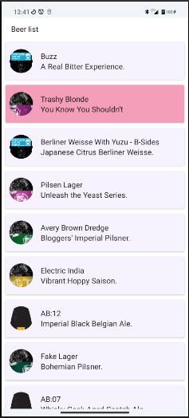
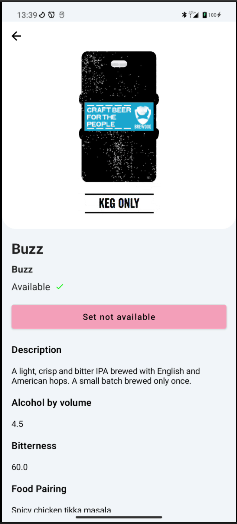
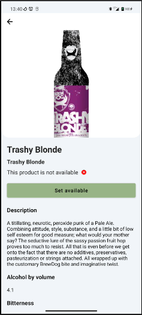
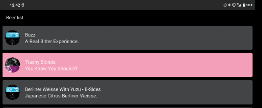
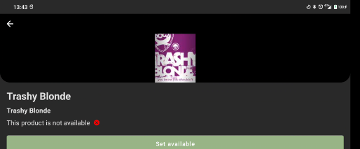

# BeerApp

BeerApp, beer application using Clean architecture, MVVM as a presentation pattern through a single
state.

The application follows a pattern master/detail and you can change every beer availability and then
the list updates accordingly this new state

# Some of the most important features

- Compose 🚀 ❤️
- Multi-module application
- Kotlin DSL for gradle
- Clean Arquitecture
- Hilt as dependency injector
- MVVM presentation pattern (Jetpack Viewmodel)
- Coroutines and Flow
- Room for database
- Testing with mockk library
- Moshi for Json parsing

# Project structure

It is a clean architecture, following a single-state MVVM pattern.

Structure of gradle:

-At the project level: Here the libraries and each of the versions are defined -At the module level:
Aliases are used to implement each of these versions

The concept of version / implementation is separated

The code is divided into several modules:

androidbase : Common Android components that could be usefull for more modules.

app : Main module of the application, it represents the outermost layer including the ui.

data : Data layer, formed by the BeerRepository and the datasources and network interfaces. The data
sources will be the local one (LocalDataSource that implements RoomDataSource), and the remote one (
RemoteDataSource that implements BeerApiClient)

domain: Domain classes; Beer, Either and Failure and constants. Interactors stay in this domain
layer too. This layer is responsible for defining the contracts that will also have data

The states associated with each of the screens are shown by a sealed class, and it represents the
state of the screen at that moment:

```
sealed class BeerListState {
        object Idle : BeerListState()
        object Loading : BeerListState()
        data class Error(val failure: Failure) : BeerListState()
        data class WithItems(val beerList: List<BeerUi>) : BeerListState()
        data class Paging(val beerList: List<BeerUi>) : BeerListState()
    }
```

This way you can show a Loader while you paginate or you can manage an error that may occur, for
example:

RoomDataSource.EmptyList -> empty list when retrieving it in the localDataSource

NetworkManager.UnexpectedServerError -> Error code that can be returned by the server in case of
If the service fails, it returns an error code and a message
NetworkManager.ServerResponseException -> Server Exception, returns an error code and a
message NetworkManager.EmptyBody -> Empty server message body

BeerApiClient.ConnectionError -> Service connection error

Failure.JsonException -> Parsing error in the Json
JsonMapper.JsonSyntaxException -> NullResult -> null data mapping error

This API consumption is done through the BeerRepository. Take a handler
connections to verify that there is a connection and the associated data and calls are sent
corresponding defined in ApiService. Two datasources are used:

- RoomDataSource that implements LocalDataSource. Get local data
- BeerApiClient that implements RemoteDataSource. Make the request by retrofit and
  data is always stored

The source of truth is the local database

The responses take an Either as return in the calls: Example

```
        override suspend fun <T, R> safeRequest(
            callRequest: Response<T>,
            functionCall: (Either.Right<T>) -> Either<Failure, R>
        ): Either<Failure, R> {


            return ((if (callRequest.isSuccessful) {
                val body = callRequest.body()

                if (body != null)
                    Either.Right(body)
                else
                    Either.Left(EmptyBody())

            } else {
                when (callRequest.code()) {
                    in 300..600 -> Either.Left(
                        ServerResponseException(
                            callRequest.code(),
                            callRequest.errorBody()?.string()
                        )
                    )
                    else -> Either.Left(
                        UnexpectedServerError(
                            callRequest.code(),
                            callRequest.errorBody()?.string()
                        )
                    )
                }
            }).flatMap { rightResult -> functionCall.invoke(rightResult) })

        }

```

Either is a monad, disjunctive union, always returns a value, or else the left class (in which
case it will be a failure) or the right (then it will be the data you are looking for). This is so because of this
how each of the possible failures is controlled when returning the request; the structure
allows an open model of request error codes or extends the abstract class
CustomFailure to decide which use cases have which errors.

Each layer has a different model: Beer has: a UI model, an entity server model,
without for example the availability field, a domain model and a database model. To make
this transformation, the layers have a converter that allows to manage conversions from one side to
another, so that the changes that may occur in the backend do not affect the rest of the application, and
vice versa.

# Testing

Se ha realizado Unit testing del repositorio, casos de uso y un par de test del BeerListViewModel


# Images

AppImages

## List and detail





## Dark mode


## Rotation at any point



